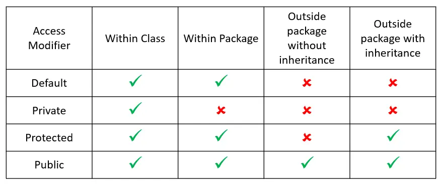

# OOP Concepts

1. **Apa itu OOP?**
   - Object Oriented Programming adalah metode pemrograman yang menggunakan Object.
   - Object berhubungan dengan satu sama lain.
   - Object adalah Instance dari sebuah Class, dimana Class seperti sebuah BluePrint.
   - Object memiliki beberapa komponen seperti Attribute (Data/Informasi), Methods (Fungsi yang bisa dilakukan Object)
   - Contoh: Class `Car` (memiliki Attribute `Speed`, `Brake` dan Fungsi `Accelerate`)
   - Class `Car` tersebut bisa dibuat Object-nya di Main atau di Class lainnya.

2. **Relationships**
   - **Inheritance**: Sebuah kelas dapat mewarisi atribut dan metode dari kelas lainnya. Ini memungkinkan penggunaan kembali kode. Misalnya, sebuah kelas `Car` dapat mewarisi kelas `Vehicle`.
   - **Association**: Ini adalah hubungan yang menunjukkan bagaimana dua objek dapat saling terhubung. Misalnya, objek `Car` memiliki objek `Engine`.
   - **Aggregation**: Satu objek bisa menjadi bagian dari objek lain tetapi dapat berdiri sendiri tanpa objek yang lebih besar. Contohnya seperti Rak Buku yang menampung Buku, Jika Rak Buku dihapus maka Buku masih tetap ada.
   - **Composition**: Satu objek bisa menjadi bagian dari objek lain tetapi TIDAK DAPAT berdiri sendiri. Contohnya seperti `Car` dan `Engine`, yang kalau `Car` dihapus maka `Engine` juga ikut terhapus.

3. **Access Modifiers**
   - **PUBLIC**
   - **PRIVATE**
   - **PROTECTED**
   - **DEFAULT**

   

